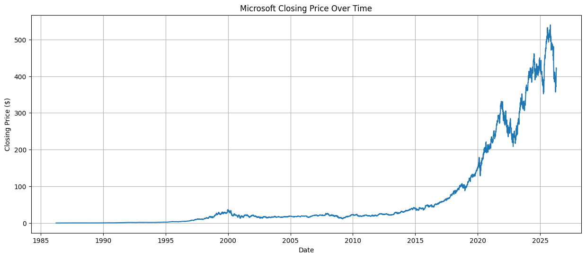
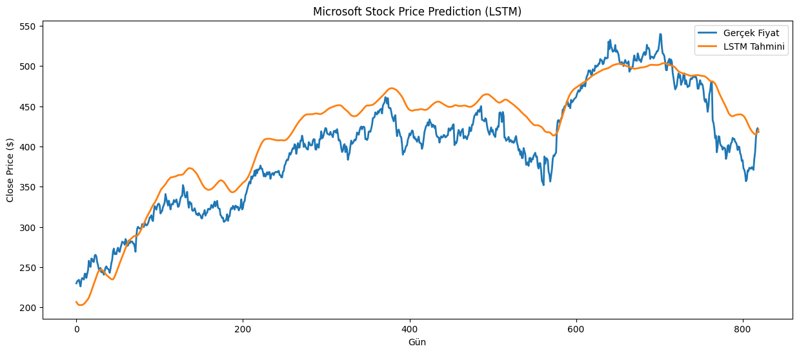
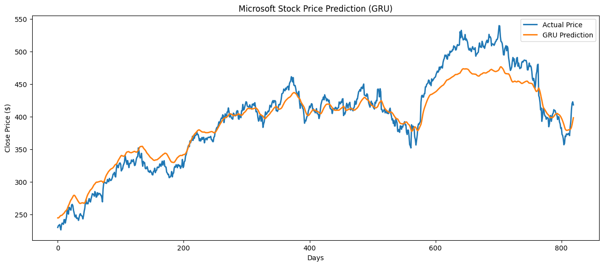
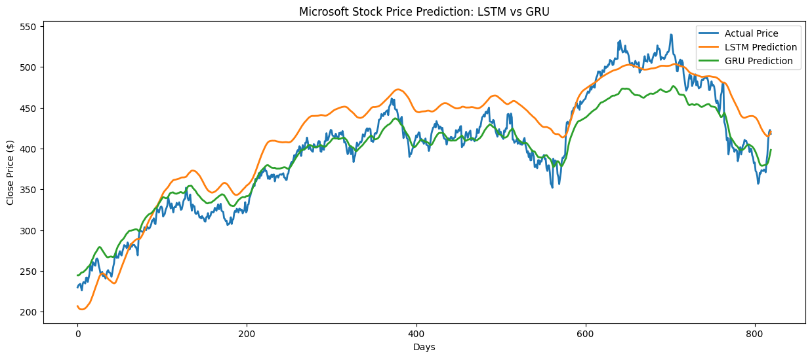

# Microsoft Stock Price Prediction Using LSTM and GRU

## Project Overview

This project aims to predict the next-day closing price of Microsoft (MSFT) stock using historical stock market data.

Two deep learning models, **Long Short-Term Memory (LSTM)** and **Gated Recurrent Unit (GRU)**, were implemented using the PyTorch framework. Both models were trained and evaluated under the same experimental conditions to ensure a fair comparison.

The prediction performance of both models was evaluated using the **Root Mean Squared Error (RMSE)** metric and visualized through prediction plots.

---

## Dataset

- **Company:** Microsoft Corporation (MSFT)
- **Target Variable:** Close Price
- **Period Used:** 2010 – 2026
- **File:** `Microsoft_stock_data.csv`

The dataset contains historical daily stock prices of Microsoft. Only the **Close** price was used for forecasting.

---

## Technologies Used

- Python
- Pandas
- NumPy
- Matplotlib
- Scikit-learn
- PyTorch
- Jupyter Notebook

---

## Data Preprocessing

The following preprocessing steps were applied before model training:

- Convert the Date column to datetime format
- Sort the dataset chronologically
- Filter the dataset to include data from 2010 onwards
- Split the dataset into training (80%) and testing (20%) sets
- Normalize the data using MinMaxScaler
- Generate 20-day sliding window sequences
- Convert NumPy arrays into PyTorch tensors

---

## Models

### Long Short-Term Memory (LSTM)

- Hidden Size: 32
- Number of Layers: 2
- Optimizer: Adam
- Loss Function: Mean Squared Error (MSE)
- Epochs: 50

### Gated Recurrent Unit (GRU)

- Hidden Size: 32
- Number of Layers: 2
- Optimizer: Adam
- Loss Function: Mean Squared Error (MSE)
- Epochs: 50

---

## Model Performance

| Model | Test RMSE |
|--------|----------:|
| LSTM | 31.98 |
| GRU | 21.01 |

The GRU model achieved a lower RMSE than the LSTM model, indicating better prediction performance on the Microsoft stock dataset.

---

## Results

Both models successfully learned the general trend of Microsoft's stock prices.

The prediction plots show that the GRU model follows the actual closing prices more closely than the LSTM model under the selected experimental settings.

### Closing Price Trend



### LSTM Prediction



### GRU Prediction



### Model Comparison



---

## Future Work

Possible improvements for future studies include:

- Using additional stock market features such as Open, High, Low, and Volume
- Testing different window sizes and hyperparameters
- Applying Transformer-based time series models
- Evaluating performance using additional metrics such as MAE and MAPE

---

## Repository Structure

```
MSFT-Stock-Prediction-LSTM-GRU/
│
├── MSFT_Stock_Prediction_LSTM_GRU.ipynb
├── Microsoft_stock_data.csv
└── README.md
```

---

## How to Run

1. Clone this repository.
2. Install the required Python libraries.
3. Open the Jupyter Notebook.
4. Run all notebook cells sequentially.
5. Compare the LSTM and GRU prediction results.
